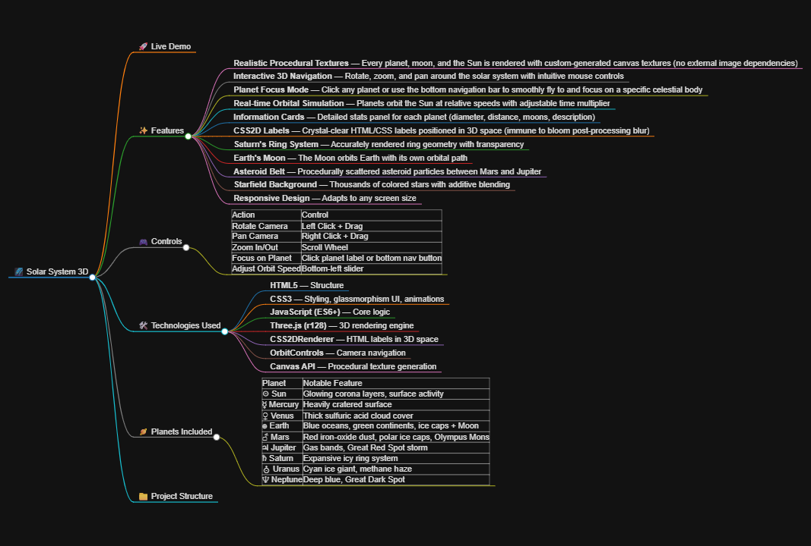

# 🌌 Solar System 3D

An interactive, real-time 3D visualization of our solar system built with **Three.js** and **HTML5 Canvas procedural textures**. Explore the planets, moons, and the Sun with smooth camera transitions and a sleek space-themed UI.

![Solar System Preview] (./assets/solar-system-preview.png)

## 🚀 Live Demo

👉 [View Live Demo](https://heinsitt.github.io/Solar-System-3D/)

## ✨ Features

- **Realistic Procedural Textures** — Every planet, moon, and the Sun is rendered with custom-generated canvas textures (no external image dependencies)
- **Interactive 3D Navigation** — Rotate, zoom, and pan around the solar system with intuitive mouse controls
- **Planet Focus Mode** — Click any planet or use the bottom navigation bar to smoothly fly to and focus on a specific celestial body
- **Real-time Orbital Simulation** — Planets orbit the Sun at relative speeds with adjustable time multiplier
- **Information Cards** — Detailed stats panel for each planet (diameter, distance, moons, description)
- **CSS2D Labels** — Crystal-clear HTML/CSS labels positioned in 3D space (immune to bloom post-processing blur)
- **Saturn's Ring System** — Accurately rendered ring geometry with transparency
- **Earth's Moon** — The Moon orbits Earth with its own orbital path
- **Asteroid Belt** — Procedurally scattered asteroid particles between Mars and Jupiter
- **Starfield Background** — Thousands of colored stars with additive blending
- **Responsive Design** — Adapts to any screen size

## 🎮 Controls

| Action | Control |
|--------|---------|
| Rotate Camera | Left Click + Drag |
| Pan Camera | Right Click + Drag |
| Zoom In/Out | Scroll Wheel |
| Focus on Planet | Click planet label or bottom nav button |
| Adjust Orbit Speed | Bottom-left slider |

## 🛠️ Technologies Used

- **HTML5** — Structure
- **CSS3** — Styling, glassmorphism UI, animations
- **JavaScript (ES6+)** — Core logic
- **Three.js (r128)** — 3D rendering engine
- **CSS2DRenderer** — HTML labels in 3D space
- **OrbitControls** — Camera navigation
- **Canvas API** — Procedural texture generation

## 🪐 Planets Included

| Planet | Notable Feature |
|--------|-----------------|
| ☉ Sun | Glowing corona layers, surface activity |
| ☿ Mercury | Heavily cratered surface |
| ♀ Venus | Thick sulfuric acid cloud cover |
| 🜨 Earth | Blue oceans, green continents, ice caps + Moon |
| ♂ Mars | Red iron-oxide dust, polar ice caps, Olympus Mons |
| ♃ Jupiter | Gas bands, Great Red Spot storm |
| ♄ Saturn | Expansive icy ring system |
| ⛢ Uranus | Cyan ice giant, methane haze |
| ♆ Neptune | Deep blue, Great Dark Spot |

## 📁 Project Structure

Solar-System-3D/
├── index.html
├── README.md
└── assets/
    ├── solar-system-preview.png
    └── features-mindmap.png
